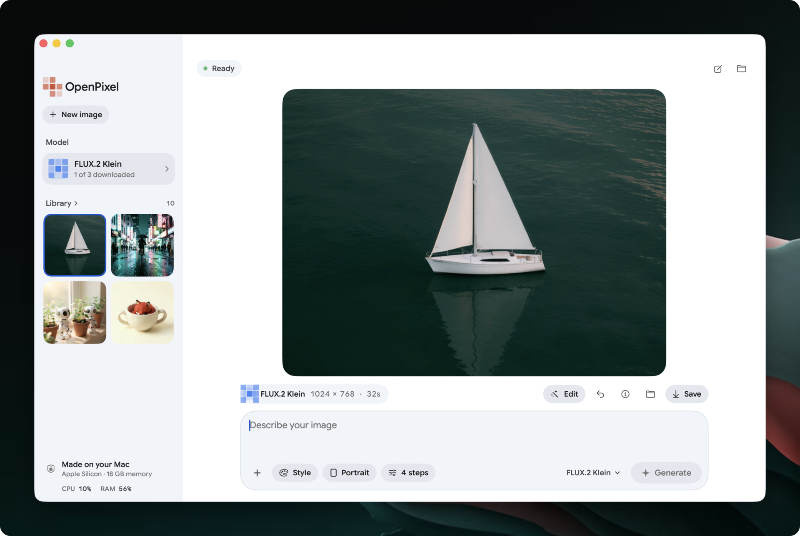
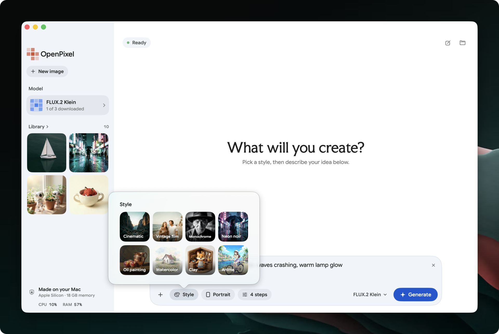
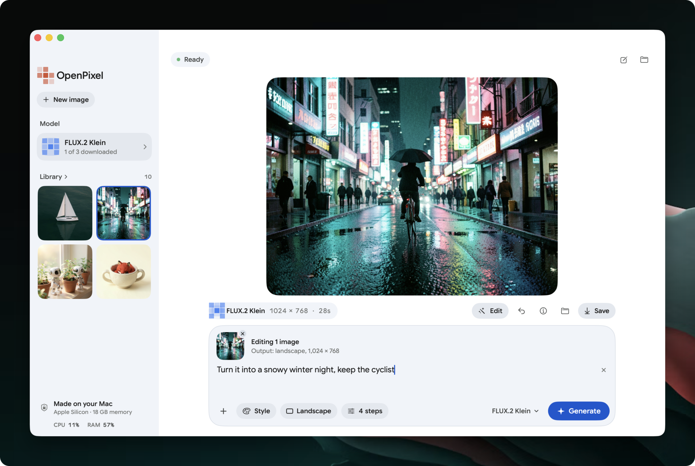
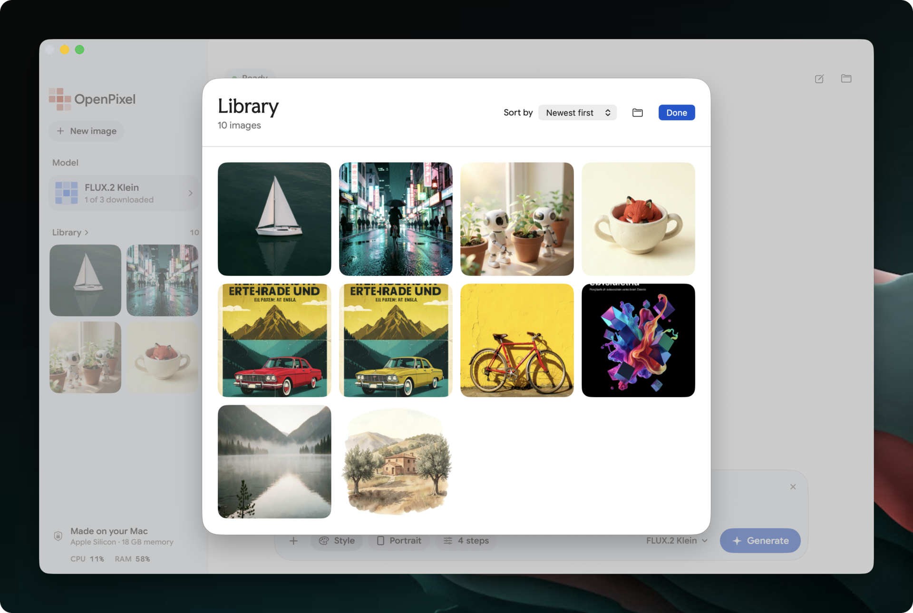
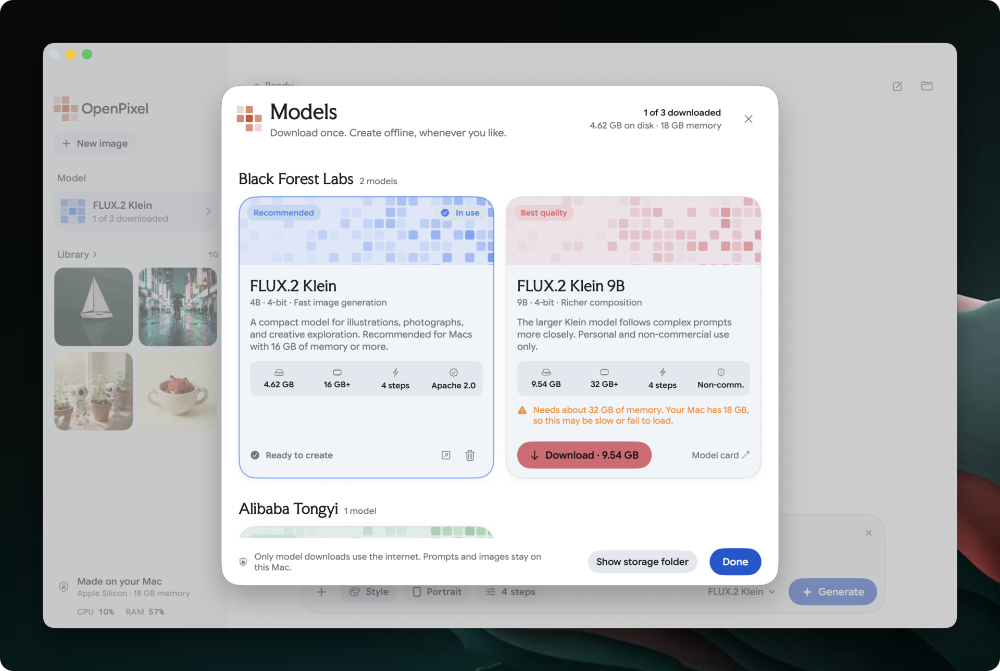

# OpenPixel

**Local AI image generation for your Mac, without node graphs or setup.**

Tools like ComfyUI and Automatic1111 are powerful, but they expect you to wire
node graphs, manage Python environments, and tune dozens of settings.
OpenPixel is for when you just want the image: type a prompt, pick a style,
and press Generate. It runs FLUX.2 Klein entirely on your Mac. You don't need
an account, a cloud service, or a Python install.



## Why OpenPixel

- **Nothing to set up.** It's a regular Mac app with its own bundled runtime.
  No terminal, `pip`, or dependency conflicts.
- **One prompt box.** Style, aspect ratio, and steps are the only settings. The
  defaults are tuned, so you rarely need to change them.
- **Models picked for you.** A short, curated catalog shows each model's size
  and memory needs. Download one with a click.
- **Edit by describing the change.** Attach an image and say what should be
  different. You don't need masks, ControlNets, or inpainting setups.
- **Made for the Mac.** A native SwiftUI app running on MLX and Apple Silicon.
  It works offline once you've downloaded a model.

If you need custom workflows, LoRAs, ControlNet, or fine-grained sampler
control, ComfyUI is the right tool. OpenPixel trades that flexibility for an
app that anyone can open and use right away.

## Get started

1. [Download the latest release](https://github.com/bm611/openpixel/releases/latest),
   open the `.dmg`, and drag **OpenPixel** into **Applications**.
2. Open **Models** (`⇧⌘M`) and download FLUX.2 Klein 4B (4.62 GB).
3. Enter a prompt, choose an aspect ratio, and generate (`⌘Return`).

The app isn't notarized yet, so macOS blocks it the first time you open it. Open
**System Settings → Privacy & Security** and click **Open Anyway**, or run
`xattr -dr com.apple.quarantine /Applications/OpenPixel.app` once.

Images save automatically. Use **Save As** (`⌘S`) to export a PNG, or **Reveal
in Finder** to find the original. The first model download needs internet;
generation works offline afterward.

### Requirements

- Apple Silicon Mac running macOS 14 or later.
- 16 GB or more unified memory recommended; performance depends on the workload.
- About 1.1 GB for the app, 4.62 GB for the model, plus space for images.

## Features

- Square, landscape, and portrait images; adjustable seed and generation steps.
- Eight prompt style presets.
- Image editing with FLUX.2 Klein: attach up to three images (**+**, drag and
  drop, or `⌘O`), or choose **Edit** on a generated image (`⇧⌘E`).
- Progress reporting, cancellation, and resumable model downloads.
- Local image history, settings reuse, PNG metadata, and JSON records.
- Model management, PNG export, and Finder integration.

| | |
|---|---|
|  |  |
| Pick a style preset, then describe your idea. | Edit an image by describing the change. |
|  |  |
| Browse and sort everything you've made. | Download and manage models. |

The initial catalog includes FLUX.2 Klein 4B, 4-bit. Other model variants shown
in the catalog are not yet validated on hardware. Qwen, LoRAs,
batch queues, and custom model imports are future work.

## Data and privacy

App data is stored in `~/Library/Application Support/OpenPixel/`:

```text
Models/  Downloaded model weights
Images/  Generated PNGs and JSON records
Logs/    Worker diagnostics
Cache/   Runtime caches
```

Models download from Hugging Face. OpenPixel has no server or analytics service;
the worker disables Hugging Face telemetry and generates from local model files.
Saved PNGs include the prompt, seed, dimensions, steps, model revision, runtime,
and generation duration. Reusing settings supports iteration but does not
guarantee identical results across hardware or runtimes.

## Build from source

Requires Xcode with Swift 6.2 or later, Apple command line tools, and
[uv](https://docs.astral.sh/uv/). No Python installation is required.

```sh
bash scripts/build.sh
open dist/OpenPixel.app
```

The first build downloads a standalone Python runtime into `.build/` and
installs the pinned worker dependencies there. It then packages the app and
verifies its local signature. Later builds reuse the runtime if the dependency
lockfile is unchanged. Open `Package.swift` in Xcode to edit the app; use the
build script to package the worker and runtime too.

## Verify

```sh
.build/runtime/bin/python3.12 -m unittest discover -s tests -v
ruff check Worker/worker.py tests/test_worker.py
ruff format --check --line-length 80 Worker/worker.py tests/test_worker.py
codesign --verify --deep --strict dist/OpenPixel.app
```

See [VALIDATION.md](VALIDATION.md) for tested workflows and generation timings.
Set `OPENPIXEL_DATA_DIR=/absolute/path` to use a separate data directory during
development.

## Implementation and licenses

The SwiftUI app communicates with a single bundled Python worker over JSON
lines. The worker manages downloads, model loading, and generation using
[mflux](https://github.com/mflux-community/mflux), MLX, and Metal. The app uses
Google Sans Flex and Faculty Glyphic fonts under the SIL Open Font License.

The model weights download separately and are listed under Apache 2.0; check the
model license before redistribution. Runtime dependency licenses are included
in the bundled distribution. See [the model card](https://huggingface.co/black-forest-labs/FLUX.2-klein-4B)
and [the pinned MLX weights](https://huggingface.co/mlx-community/flux2-klein-4b-4bit).
